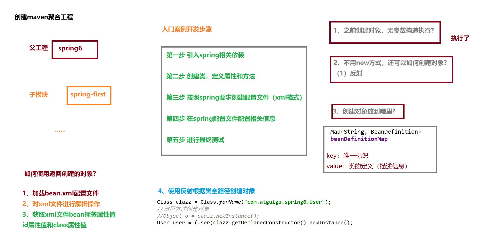

#  1 Spring入门案例开发步骤
1. 引入 spring 相关依赖
    ```xml
    <dependencies>
        <!--spring context依赖-->
        <!--当你引入Spring Context依赖之后，表示将Spring的基础依赖引入了-->
        <dependency>
            <groupId>org.springframework</groupId>
            <artifactId>spring-context</artifactId>
            <version>6.0.2</version>
        </dependency>
    
        <!--junit5测试-->
        <dependency>
            <groupId>org.junit.jupiter</groupId>
            <artifactId>junit-jupiter-api</artifactId>
            <version>5.3.1</version>
        </dependency>
    </dependencies>
    ```
2. 创建类,定义属性和方法
    ```java
    package com.atguigu.spring6;
    
    public class User {
        public void sayHello(){
            System.out.println("helloworld");
        }
    }
    ```
3. 按照 spring 要求创建配置文件
   - 在resources目录创建一个 Spring 配置文件 beans.xml（配置文件名称可随意命名，如：springs.xm）
4. 在 spring 配置文件中配置相关信息
    ```xml
    <?xml version="1.0" encoding="UTF-8"?>
    <beans xmlns="http://www.springframework.org/schema/beans"
           xmlns:xsi="http://www.w3.org/2001/XMLSchema-instance"
           xsi:schemaLocation="http://www.springframework.org/schema/beans http://www.springframework.org/schema/beans/spring-beans.xsd">
    
        <!--
        属性：
            id：设置bean的唯一标识
            class：设置bean所对应类型的全类名
        -->
        <bean id="user" class="com.atguigu.spring6.User"></bean>
    
    </beans>
    ```
5. 进行最终测试
   ```java
   package com.atguigu.spring6;
   import org.junit.jupiter.api.Test;
   import org.springframework.context.support.ClassPathXmlApplicationContext;
   
   /**
    * @Author: Admin
    * @Create: 2024/7/1 - 下午3:35
    * @Version: v1.0
    * ClassName: TestUser
    * Package: com.atguigu.spring6
    * Description: 描述
    */
   public class TestUser {
   
       @Test
       public void testUser() {
           // 1. 加载 spring 配置对象, 创建 spring 容器对象
           ClassPathXmlApplicationContext contxt = new ClassPathXmlApplicationContext("bean.xml");
           // 2. 获取创建的对象
           User user = contxt.getBean("user", User.class);
           // 3. 使用对象调用方法进行测试
           System.out.println("user = " + user);
           user.sayHello();
            // 之前的写法
            User user = new User();
            user.sayHello();
       }
   }
   ```


# 2 启用Log4j2日志框架
   ```xml
   <!--log4j2的依赖-->
   <dependency>
       <groupId>org.apache.logging.log4j</groupId>
       <artifactId>log4j-core</artifactId>
       <version>2.19.0</version>
   </dependency>
   <dependency>
       <groupId>org.apache.logging.log4j</groupId>
       <artifactId>log4j-slf4j2-impl</artifactId>
       <version>2.19.0</version>
   </dependency>
   ```
- 在类的根路径下提供log4j2.xml配置文件（文件名固定为：log4j2.xml，文件必须放到类根路径下。）
```xml
<?xml version="1.0" encoding="UTF-8"?>
<!--日志级别以及优先级排序: OFF > FATAL > ERROR > WARN > INFO > DEBUG > TRACE > ALL -->
<!--Configuration后面的status，这个用于设置log4j2自身内部的信息输出，可以不设置，当设置成trace时，你会看到log4j2内部各种详细输出-->
<!--monitorInterval：Log4j能够自动检测修改配置 文件和重新配置本身，设置间隔秒数-->
<configuration status="WARN" monitorInterval="30">
    <Properties>
        <Property name="LOG_HOME">../logs/spring-first/</Property>
        <!--_TRACE_ID，业务自定义变量-->
        <property name="ALL_PATTERN">[%d{yyyy-MM-dd HH:mm:ss.SSS}][%t][%p]- %l - %m%n</property>
        <property name="CHARSET">UTF-8</property>
        <property name="FILE_SIZE">1GB</property>
        <property name="FILE_INDEX_MAX">30</property>
    </Properties>
    <!--先定义所有的appender-->
    <appenders>
        <!--这个输出控制台的配置-->
        <console name="Console" target="SYSTEM_OUT">
            <!--输出日志的格式-->
            <PatternLayout pattern="${ALL_PATTERN}"/>
        </console>
        <!--文件会打印出所有信息，这个log每次运行程序会自动清空，由append属性决定，这个也挺有用的，适合临时测试用-->
        <File name="log" fileName="${LOG_HOME}/spring-first.log" append="false">
            <PatternLayout pattern="${ALL_PATTERN}"/>
        </File>
        <!-- 这个会打印出所有的debug及以下级别的信息，每次大小超过size，则这size大小的日志会自动存入按年份-月份建立的文件夹下面并进行压缩，作为存档-->
        <RollingFile name="RollingFileDebug" fileName="${LOG_HOME}/debug.log"
                     filePattern="${LOG_HOME}/logs/$${date:yyyy-MM}/warn-%d{yyyy-MM-dd}-%i.log">
            <ThresholdFilter level="debug" onMatch="ACCEPT" onMismatch="DENY"/>
            <PatternLayout pattern="${ALL_PATTERN}"/>
            <Policies>
                <TimeBasedTriggeringPolicy/>
                <SizeBasedTriggeringPolicy size="100 MB"/>
            </Policies>
            <!-- DefaultRolloverStrategy属性如不设置，则默认为最多同一文件夹下7个文件，这里设置了20 -->
            <DefaultRolloverStrategy max="20"/>
        </RollingFile>
        <RollingFile name="RollingFileInfo" fileName="${LOG_HOME}/info.log"
                     filePattern="${LOG_HOME}/logs/$${date:yyyy-MM}/info-%d{yyyy-MM-dd}-%i.log">
            <!--控制台只输出level及以上级别的信息（onMatch），其他的直接拒绝（onMismatch）-->
            <ThresholdFilter level="info" onMatch="ACCEPT" onMismatch="DENY"/>
            <PatternLayout pattern="${ALL_PATTERN}"/>
            <Policies>
                <TimeBasedTriggeringPolicy/>
                <SizeBasedTriggeringPolicy size="100 MB"/>
            </Policies>
        </RollingFile>
        <RollingFile name="RollingFileError" fileName="${LOG_HOME}/error.log"
                     filePattern="${LOG_HOME}/logs/$${date:yyyy-MM}/error-%d{yyyy-MM-dd}-%i.log">
            <ThresholdFilter level="error" onMatch="ACCEPT" onMismatch="DENY"/>
            <PatternLayout pattern="${ALL_PATTERN}"/>
            <Policies>
                <TimeBasedTriggeringPolicy/>
                <SizeBasedTriggeringPolicy size="100 MB"/>
            </Policies>
        </RollingFile>
    </appenders>
    <!--然后定义logger，只有定义了logger并引入的appender，appender才会生效-->
    <loggers>
        <logger name="org.springframework" level="DEBUG"></logger>
        <root level="all">
            <appender-ref ref="Console"/>
            <appender-ref ref="RollingFileDebug"/>
            <appender-ref ref="RollingFileInfo"/>
            <appender-ref ref="RollingFileError"/>
        </root>
    </loggers>
</configuration>
```

# 3 IOC 容器
- IOC 容器是Spring框架的核心，它提供了对象实例化的功能，对象实例化后，对象之间的依赖关系由容器来维护。
- Spring 通过 IOC 容器来管理所有对象的实例化和初始化,控制对象与对象之间的依赖关系
- 我们将由 IOC 容器管理的对象称为 Spring Bean 它与使用关键字 new 创建的对象没有任何区别
- 

## 3.1 IOC 基于 XML 管理 Bean
```xml
<?xml version="1.0" encoding="UTF-8"?>
<beans xmlns="http://www.springframework.org/schema/beans"
       xmlns:xsi="http://www.w3.org/2001/XMLSchema-instance"
       xsi:schemaLocation="http://www.springframework.org/schema/beans http://www.springframework.org/schema/beans/spring-beans.xsd">

    <!--User 对象创建-->
    <bean id="user" class="com.atguigu.spring6.iocxml.User"></bean>
</beans>
```
### 3.1.1 搭建子模块spring6-ioc-xml
### 3.1.2 实验一:获取bean
```java
package com.atguigu.spring6.iocxml;
import org.springframework.context.support.ClassPathXmlApplicationContext;

/**
 * @Author: Admin
 * @Create: 2024/7/4 - 上午10:03
 * @Version: v1.0
 * ClassName: TestUser
 * Package: com.atguigu.spring6.iocxml
 * Description: 描述
 */
public class TestUser {

   public static void main(String[] args){
       // <bean id="user" class="com.atguigu.spring6.iocxml.User"></bean>
       ClassPathXmlApplicationContext context = new ClassPathXmlApplicationContext("bean.xml");
       // 根据 id 获取 bean
       User user = context.getBean("user", User.class);
       System.out.println(user);

       // 根据类型获取 bean
       User user1 = context.getBean(User.class);
       System.out.println(user1);

       // 根据 id 和类型获取 bean
       User user2 = context.getBean("user", User.class);
       System.out.println(user2);
   }
}
```
```java
package com.atguigu.spring6.iocxml.bean;
import org.springframework.context.support.ClassPathXmlApplicationContext;

/**
 * @Author: Admin
 * @Create: 2024/7/4 - 下午4:10
 * @Version: v1.0
 * ClassName: TestUserDao
 * Package: com.atguigu.spring6.iocxml.bean
 * Description: 描述
 */
public class TestUserDao {
    public static void main(String[] args) {
         // <!-- 2. 一个接口实现类获取过程-->
         // <bean id="userDao" class="com.atguigu.spring6.iocxml.bean.UserDaoImpl"></bean>
         // <bean id="personDao" class="com.atguigu.spring6.iocxml.bean.PersonDaoImpl"></bean>
        ClassPathXmlApplicationContext context = new ClassPathXmlApplicationContext("bean.xml");
        // 根据接口获取接口对应的 bean
        // 要求只能有一个实现类,多个实现类会报错
        // UserDao userDao = context.getBean( UserDao.class);
        // System.out.println(userDao);

        // 根据 id 和类型获取 bean
        UserDao userDao = context.getBean("userDao", UserDao.class);
        UserDao personDao = context.getBean("personDao", UserDao.class);

        System.out.println(userDao);
        System.out.println(personDao);
    }
}
```
### 3.1.3 实验二:依赖注入之setter注入
- 创建类,定义属性,生成属性 set 方法
- 在 Spring 配置文件中配置
```xml
<?xml version="1.0" encoding="UTF-8"?>
<beans xmlns="http://www.springframework.org/schema/beans"
       xmlns:xsi="http://www.w3.org/2001/XMLSchema-instance"
       xsi:schemaLocation="http://www.springframework.org/schema/beans http://www.springframework.org/schema/beans/spring-beans.xsd">

   <!--基于 set 方法注入-->
   <bean id="book" class="com.atguigu.spring6.iocxml.di.Book">
      <property name="name" value="java"/>
      <property name="author" value="zhangsan"/>
   </bean>
</beans>
```
```java
package com.atguigu.spring6.iocxml.di;
import org.junit.jupiter.api.Test;
import org.springframework.context.support.ClassPathXmlApplicationContext;
/**
 * @Author: Admin
 * @Create: 2024/7/5 - 上午10:03
 * @Version: v1.0
 * ClassName: TestDiBook
 * Package: com.atguigu.spring6.iocxml.di
 * Description: 描述
 */
public class TestDiBook {
    @Test
    public void testSet(){
        // 加载配置文件
        ClassPathXmlApplicationContext context = new ClassPathXmlApplicationContext("bean-di.xml");
        // 根据 id 和类型获取 bean
        Book book = context.getBean("book", Book.class);
        System.out.println(book);

    }
}
```
### 3.1.4 实验三:依赖注入之构造器注入
```xml
<?xml version="1.0" encoding="UTF-8"?>
<beans xmlns="http://www.springframework.org/schema/beans"
       xmlns:xsi="http://www.w3.org/2001/XMLSchema-instance"
       xsi:schemaLocation="http://www.springframework.org/schema/beans http://www.springframework.org/schema/beans/spring-beans.xsd">
    <!--构造器和构造方法注入-->
    <bean id="bookCon" class="com.atguigu.spring6.iocxml.di.Book">
        <constructor-arg name="name" value="java"/>
        <constructor-arg name="author" value="zhangsan"/>
    </bean>
</beans>
```
```java
package com.atguigu.spring6.iocxml.di;
import org.junit.jupiter.api.Test;
import org.springframework.context.support.ClassPathXmlApplicationContext;
/**
 * @Author: Admin
 * @Create: 2024/7/5 - 上午10:03
 * @Version: v1.0
 * ClassName: TestDiBook
 * Package: com.atguigu.spring6.iocxml.di
 * Description: 描述
 */
public class TestDiBook {
    @Test
    public void testSet(){
        /*具体流程如下：
            Spring 根据配置文件中 <bean> 元素的 class 属性找到 Book 类。
            Spring 使用无参构造器实例化 Book 对象，这时会输出 "book无参构造器"。
            Spring 调用 setName 和 setAuthor 方法注入 name 和 author 属性。*/
        // 加载配置文件
        ClassPathXmlApplicationContext context = new ClassPathXmlApplicationContext("bean-di.xml");
        // 根据 id 和类型获取 bean
        Book book = context.getBean("book", Book.class);
        System.out.println(book);

    }

    @Test
    public void testConstructor(){
        /*具体流程如下：
            Spring 根据配置文件中 <bean> 元素的 class 属性找到 Book 类。
            Spring 使用有参构造器实例化 Book 对象，这时会输出 "book有参构造器"。
            Spring 通过有参构造器注入 name 和 author 属性。*/
        // 加载配置文件
        ClassPathXmlApplicationContext context = new ClassPathXmlApplicationContext("bean-di.xml");
        // 根据 id 和类型获取 bean
        Book book = context.getBean("bookCon", Book.class);
        System.out.println(book);

    }
}

```
### 3.1.5 实验四:特殊值处理
```xml
<?xml version="1.0" encoding="UTF-8"?>
<beans xmlns="http://www.springframework.org/schema/beans"
       xmlns:xsi="http://www.w3.org/2001/XMLSchema-instance"
       xsi:schemaLocation="http://www.springframework.org/schema/beans http://www.springframework.org/schema/beans/spring-beans.xsd">
    <!--基于 set 方法注入-->
    <bean id="book" class="com.atguigu.spring6.iocxml.di.Book">
        <property name="name" value="java"/>
        <property name="author" value="zhangsan"/>
        <!--        1. 空值处理-->
        <!--        <property name="others" >-->
        <!--        <null></null>-->
        <!--        </property>-->

        <!--        2. 空值处理-->
        <!--        <property name="others" value="&lt;&gt;" />-->

        <!--        3. CDATA 处理-->
        <!--        <property name="others" >-->
        <!--            <value>-->
        <!--                <![CDATA[a<b]]>-->
        <!--            </value>-->
        <!--        </property>-->
    </bean>

</beans>
```
### 3.1.6 实验五:为对象类型属性赋值
- 引用外部 bean
  - 创建 dept 和 emp 对象
    ```java
    package com.atguigu.spring6.iocxml.ditest;
    public class Dept {
        private String deptName;
    
        public void setDeptName(String deptName) {
            this.deptName = deptName;
        }
    
        public void info() {
            System.out.println("部门名称：" + deptName);
        }
    }
    ```
    ```java
    package com.atguigu.spring6.iocxml.ditest;
    public class Emp {
        private String name;
        private Integer age;
        private Dept dept;
    
        public void work() {
            System.out.println(name + " " + age + " is working");
            dept.info();
        }
    
        public void setName(String name) {
            this.name = name;
        }
    
        public void setAge(Integer age) {
            this.age = age;
        }
    
        public void setDept(Dept dept) {
            this.dept = dept;
        }
    }
    ```
  - 注入普通类型属性
  - 在 emp 的 bean 标签中引用 dept 的 bean 标签
    ```xml
    <?xml version="1.0" encoding="UTF-8"?>
    <beans xmlns="http://www.springframework.org/schema/beans"
    xmlns:xsi="http://www.w3.org/2001/XMLSchema-instance"
    xsi:schemaLocation="http://www.springframework.org/schema/beans http://www.springframework.org/schema/beans/spring-beans.xsd">
        <!--
        方法1: 引入外部 bean
            1. 创建两个类对象: dept 和 emp
            2. 在 dept 和 emp 标签里面,使用 property 引入 dept 的 bean
        -->
        <bean id="dept" class="com.atguigu.spring6.iocxml.ditest.Dept">
            <property name="deptName" value="开发部"/>
        </bean>
        <bean id="emp" class="com.atguigu.spring6.iocxml.ditest.Emp">
            <!--普通属性注入 value -->
            <property name="age" value="18"/>
            <property name="name" value="张三"/>
            <!--对象类型属性注入 ref="bean的id" -->
            <property name="dept" ref="dept"/>
        </bean>
    </beans>
    ```
  - 引用内部 bean
      ```xml
      <?xml version="1.0" encoding="UTF-8"?>
      <beans xmlns="http://www.springframework.org/schema/beans"
             xmlns:xsi="http://www.w3.org/2001/XMLSchema-instance"
             xsi:schemaLocation="http://www.springframework.org/schema/beans http://www.springframework.org/schema/beans/spring-beans.xsd">
          <!--
          方法2:内部 bean
          -->
          <bean id="emp2" class="com.atguigu.spring6.iocxml.ditest.Emp">
              <!--普通属性注入 value -->
              <property name="age" value="44"/>
              <property name="name" value="李四"/>
              <!--内部 bean-->
              <property name="dept">
                  <bean id="dept2" class="com.atguigu.spring6.iocxml.ditest.Dept">
                      <property name="deptName" value="测试部"/>
                  </bean>
              </property>
          </bean>
      </beans>
      ```
      ```java
      package com.atguigu.spring6.iocxml.ditest;
      import org.springframework.context.support.ClassPathXmlApplicationContext;
        public class TestEmp {
        public static void main(String[] args) {
        // 加载配置文件
        ClassPathXmlApplicationContext context = new ClassPathXmlApplicationContext("bean-ditest.xml");
        // 通过 id 和 class 获取 bean
        Emp emp = context.getBean("emp2", Emp.class);
        emp.work();
        }
      }
      ```
- 级联属性赋值
    ```xml
    <?xml version="1.0" encoding="UTF-8"?>
    <beans xmlns="http://www.springframework.org/schema/beans"
           xmlns:xsi="http://www.w3.org/2001/XMLSchema-instance"
           xsi:schemaLocation="http://www.springframework.org/schema/beans http://www.springframework.org/schema/beans/spring-beans.xsd">
        <!--级联赋值-->
        <bean id="dept3" class="com.atguigu.spring6.iocxml.ditest.Dept">
            <property name="deptName" value="333部"/>
        </bean>
        <bean id="emp3" class="com.atguigu.spring6.iocxml.ditest.Emp">
            <property name="name" value="小明"/>
            <property name="age" value="33"/>
            <property name="dept" ref="dept3"></property>
            <property name="deptName" value="444部"></property>
        </bean>
    </beans>
    ```
```java
package com.atguigu.spring6.iocxml.ditest;
public class Emp {
    private String name;
    private Integer age;
    private Dept dept;

    public void work() {
        System.out.println(name + " " + age + " is working");
        dept.info();
    }

    public void setName(String name) {
        this.name = name;
    }

    public void setAge(Integer age) {
        this.age = age;
    }

    public void setDept(Dept dept) {
        this.dept = dept;
    }

    // 这里是关键
    public void setDeptName(String deptName) {
        if (this.dept != null) {
            this.dept.setDeptName(deptName);
        }
    }
}
```
### 3.1.7 实验六:为数组类型属性赋值
```xml
<?xml version="1.0" encoding="UTF-8"?>
<beans xmlns="http://www.springframework.org/schema/beans"
       xmlns:xsi="http://www.w3.org/2001/XMLSchema-instance"
       xsi:schemaLocation="http://www.springframework.org/schema/beans http://www.springframework.org/schema/beans/spring-beans.xsd">
    <!--注入数组类型的属性-->
    <bean id="dept" class="com.atguigu.spring6.iocxml.ditest.Dept">
        <property name="deptName" value="开发部"></property>
    </bean>
    <bean id="emp" class="com.atguigu.spring6.iocxml.ditest.Emp">
        <!--普通属性-->
        <property name="name" value="张三"/>
        <property name="age" value="18"/>
        <!--对象类型属性-->
        <property name="dept" ref="dept"/>
        <!--数组类型属性-->
        <property name="loves">
            <array>
                <value>football</value>
                <value>basketball</value>
                <value>swimming</value>
            </array>
        </property>
    </bean>
</beans>
```
### 3.1.8 实验七:为集合类型属性赋值
- 为 List 集合类型属性赋值
```xml
<?xml version="1.0" encoding="UTF-8"?>
<beans xmlns="http://www.springframework.org/schema/beans"
       xmlns:xsi="http://www.w3.org/2001/XMLSchema-instance"
       xsi:schemaLocation="http://www.springframework.org/schema/beans http://www.springframework.org/schema/beans/spring-beans.xsd">

    <bean id="emp1" class="com.atguigu.spring6.iocxml.ditest.Emp">
        <property name="name" value="张三"/>
        <property name="age" value="18"/>
    </bean>
    <bean id="emp2" class="com.atguigu.spring6.iocxml.ditest.Emp">
        <property name="name" value="李四"/>
        <property name="age" value="20"/>
    </bean>
    <bean id="dept" class="com.atguigu.spring6.iocxml.ditest.Dept">
        <property name="deptName" value="开发部"/>
        <property name="empList">
            <list>
                <ref bean="emp1"/>
                <ref bean="emp2"/>
            </list>
        </property>
    </bean>
</beans>
```
- 为 map 类型属性赋值
```xml
<?xml version="1.0" encoding="UTF-8"?>
<beans xmlns="http://www.springframework.org/schema/beans"
       xmlns:xsi="http://www.w3.org/2001/XMLSchema-instance"
       xsi:schemaLocation="http://www.springframework.org/schema/beans http://www.springframework.org/schema/beans/spring-beans.xsd">

    <!--
        1. 创建两个对象
        2. 注入普通类型属性
        3. 在学生 bean 注入 map 集合类型属性
    -->
    <bean id="teacher1" class="com.atguigu.spring6.iocxml.dimap.Teacher">
        <property name="id" value="1"/>
        <property name="name" value="张三"/>
    </bean>
    <bean id="teacher2" class="com.atguigu.spring6.iocxml.dimap.Teacher">
        <property name="id" value="2"/>
        <property name="name" value="小明"/>
    </bean>
    <bean id="student" class="com.atguigu.spring6.iocxml.dimap.Student">
        <property name="id" value="11"/>
        <property name="name" value="李四"/>
        <property name="teacherMap">
            <map>
                <entry key="a" value-ref="teacher1"/>
                <entry key="b" value-ref="teacher2"/>
            </map>
        </property>
    </bean>
</beans>
```
```java
package com.atguigu.spring6.iocxml.dimap;
import java.util.Map;

public class Student {
    private String name;
    private String id;
    private Map<String,Teacher> teacherMap;

    public String getId() {
        return id;
    }

    public void setId(String id) {
        this.id = id;
    }

    public String getName() {
        return name;
    }

    public void setName(String name) {
        this.name = name;
    }

    public Map<String, Teacher> getTeacherMap() {
        return teacherMap;
    }

    public void setTeacherMap(Map<String, Teacher> teacherMap) {
        this.teacherMap = teacherMap;
    }

    public void run (){
        System.out.println("学生的id"+id+"  学生的name"+name);
        System.out.println(teacherMap);
    }
}
```
```java
package com.atguigu.spring6.iocxml.dimap;
public class Teacher {
    private String name;
    private String id;

    public String getName() {
        return name;
    }

    public void setName(String name) {
        this.name = name;
    }

    public String getId() {
        return id;
    }

    public void setId(String id) {
        this.id = id;
    }

    @Override
    public String toString() {
        return "Teacher{" +
                "name='" + name + '\'' +
                ", id='" + id + '\'' +
                '}';
    }
}
```
```java
package com.atguigu.spring6.iocxml.dimap;
import org.springframework.context.support.ClassPathXmlApplicationContext;
public class TestStudent {

    public static void main(String[] args) {
        ClassPathXmlApplicationContext context = new ClassPathXmlApplicationContext("bean-dimap.xml");
        Student student = context.getBean("student", Student.class);
        student.run();
    }
}
```
- 引用集合类型的 bean
```xml
<?xml version="1.0" encoding="UTF-8"?>
<beans xmlns="http://www.springframework.org/schema/beans"
       xmlns:xsi="http://www.w3.org/2001/XMLSchema-instance"
       xmlns:util="http://www.springframework.org/schema/util"
       xsi:schemaLocation="http://www.springframework.org/schema/util
       http://www.springframework.org/schema/util/spring-util.xsd
       http://www.springframework.org/schema/beans
       http://www.springframework.org/schema/beans/spring-beans.xsd"
>

    <!--
        1. 创建三个对象
        2. 注入普通类型属性
        3. 使用 util: 类型 定义
        4. 在学生 bean 引入 util: 定义 bean 完成 list,map 类型属性的注入
    -->
    <bean id="student" class="com.atguigu.spring6.iocxml.dimap.Student">
        <property name="name" value="学生"/>
        <property name="id" value="11"/>
        <!--注入 list,map 属性-->
        <property name="lessonList" ref="lessonList"></property>
        <property name="teacherMap" ref="teacherMap"></property>
    </bean>

    <util:list id="lessonList">
        <ref bean="lesson1"></ref>
        <ref bean="lesson2"></ref>
    </util:list>
    <util:map id="teacherMap">
        <!--下面代码会报错-->
        <entry>
            <key>
                <value>11111</value>
            </key>
            <ref bean="teacher1"></ref>
        </entry>
        <entry>
            <key>
                <value>222222</value>
            </key>
            <ref bean="teacher2"></ref>
        </entry>
    </util:map>

    <bean id="teacher1" class="com.atguigu.spring6.iocxml.dimap.Teacher">
        <property name="name" value="teacher1"/>
        <property name="id" value="1"/>
    </bean>
    <bean id="teacher2" class="com.atguigu.spring6.iocxml.dimap.Teacher">
        <property name="name" value="teacher2"/>
        <property name="id" value="2"/>
    </bean>
    <bean id="lesson1" class="com.atguigu.spring6.iocxml.dimap.Lesson">
        <property name="name" value="java"/>
    </bean>
    <bean id="lesson2" class="com.atguigu.spring6.iocxml.dimap.Lesson">
        <property name="name" value="spring"/>
    </bean>
</beans>
```
```java
package com.atguigu.spring6.iocxml.dimap;
import java.util.List;
import java.util.Map;

public class Student {
    private String name;
    private String id;
    private Map<String,Teacher> teacherMap;
    private List<Lesson> lessonList;

    public String getId() {
        return id;
    }

    public void setId(String id) {
        this.id = id;
    }

    public String getName() {
        return name;
    }

    public void setName(String name) {
        this.name = name;
    }

    public Map<String, Teacher> getTeacherMap() {
        return teacherMap;
    }

    public void setTeacherMap(Map<String, Teacher> teacherMap) {
        this.teacherMap = teacherMap;
    }

    public List<Lesson> getLessonList() {
        return lessonList;
    }

    public void setLessonList(List<Lesson> lessonList) {
        this.lessonList = lessonList;
    }

    public void run (){
        System.out.println("学生的id"+id+"  学生的name"+name);
        System.out.println(teacherMap);
        System.out.println(lessonList);
    }
}
```
```java
package com.atguigu.spring6.iocxml.dimap;
public class Lesson {
    private String name;

    public String getName() {
        return name;
    }

    public void setName(String name) {
        this.name = name;
    }

    @Override
    public String toString() {
        return "Lesson{" +
                "name='" + name + '\'' +
                '}';
    }
}
```
```java
package com.atguigu.spring6.iocxml.dimap;
public class Teacher {
    private String name;
    private String id;

    public String getName() {
        return name;
    }

    public void setName(String name) {
        this.name = name;
    }

    public String getId() {
        return id;
    }

    public void setId(String id) {
        this.id = id;
    }

    @Override
    public String toString() {
        return "Teacher{" +
                "name='" + name + '\'' +
                ", id='" + id + '\'' +
                '}';
    }
}
```
### 3.1.9 实验八:p命名空间
```xml
<?xml version="1.0" encoding="UTF-8"?>
<beans xmlns="http://www.springframework.org/schema/beans"
       xmlns:xsi="http://www.w3.org/2001/XMLSchema-instance"
       xmlns:util="http://www.springframework.org/schema/util"
       xmlns:p="http://www.springframework.org/schema/p"
       xsi:schemaLocation="http://www.springframework.org/schema/util
       http://www.springframework.org/schema/util/spring-util.xsd
       http://www.springframework.org/schema/beans
       http://www.springframework.org/schema/beans/spring-beans.xsd"
>
    <!--P命名空间注入-->
    <bean id="studentp" class="com.atguigu.spring6.iocxml.dimap.Student"
          p:id="1pp" p:name="张三pp"
          p:lessonList-ref="lessonList"
          p:teacherMap-ref="teacherMap"
    />
</beans>
```
### 3.1.10 实验九:引入外部属性文件
```properties
jdbc.user=root
jdbc.password=qwert123
jdbc.url=jdbc:mysql://localhost:3306/atguigu?serverTimezone=UTC
jdbc.driver=com.mysql.cj.jdbc.Driver
```
```xml
<?xml version="1.0" encoding="UTF-8"?>
<beans xmlns="http://www.springframework.org/schema/beans"
       xmlns:xsi="http://www.w3.org/2001/XMLSchema-instance"
       xmlns:context="http://www.springframework.org/schema/context"
       xsi:schemaLocation="
       http://www.springframework.org/schema/context
       http://www.springframework.org/schema/context/spring-context.xsd
       http://www.springframework.org/schema/beans
       http://www.springframework.org/schema/beans/spring-beans.xsd
">
    <!--引入外部属性文件-->
    <!--<context:property-placeholder location="jdbc.properties"/>-->
    <context:property-placeholder location="classpath:jdbc.properties"/>
    <!--完成数据库数据的注入-->
    <bean id="druidDataSource" class="com.alibaba.druid.pool.DruidDataSource">
        <property name="url" value="${jdbc.url}"/>
        <property name="username" value="${jdbc.user}"/>
        <property name="password" value="${jdbc.password}"/>
        <property name="driverClassName" value="${jdbc.driver}"/>
    </bean>
</beans>
```
```java
package com.atguigu.spring6.iocxml.jdbc;

import com.alibaba.druid.pool.DruidDataSource;
import org.junit.jupiter.api.Test;
import org.springframework.context.support.ClassPathXmlApplicationContext;
import java.sql.Connection;
import java.sql.SQLException;

public class TestJdbc {

    @Test
    public void test() throws SQLException {
        // 方法一
        // DruidDataSource druidDataSource = new DruidDataSource();
        // druidDataSource.setUrl("jdbc:mysql://localhost:3306/atguigu?serverTimezone=UTC");
        // druidDataSource.setUsername("root");
        // druidDataSource.setPassword("qwert123");
        // druidDataSource.setDriverClassName("com.mysql.cj.jdbc.Driver");
        // System.out.println(druidDataSource.getConnection());

        // 方法二
        ClassPathXmlApplicationContext context = new ClassPathXmlApplicationContext("bean-jdbc.xml");
        DruidDataSource druidDataSource = context.getBean(DruidDataSource.class);
        System.out.println(druidDataSource.getConnection());
    }
}
```
### 3.1.11 实验十:bean的作用域
```xml
<?xml version="1.0" encoding="UTF-8"?>
<beans xmlns="http://www.springframework.org/schema/beans"
       xmlns:xsi="http://www.w3.org/2001/XMLSchema-instance"
       xsi:schemaLocation="http://www.springframework.org/schema/beans http://www.springframework.org/schema/beans/spring-beans.xsd">
    <!--
    通过 scope 可以配置单实例还是多实例  默认单实例
    单实例是初始化的时候创建  多实例是 getBean 的时候创建
    singleton  单实例
    prototype  多实例
    -->
    <bean id="orders" class="com.atguigu.spring6.iocxml.scope.Orders" scope="singleton">
    </bean>
</beans>
```
```java
package com.atguigu.spring6.iocxml.scope;
import org.springframework.context.support.ClassPathXmlApplicationContext;

public class TestOrders {
    public static void main(String[] args) {
        ClassPathXmlApplicationContext context = new ClassPathXmlApplicationContext("bean-scope.xml");
        Orders orders1 = context.getBean("orders", Orders.class);
        Orders orders2 = context.getBean("orders", Orders.class);
        System.out.println(orders1);
        System.out.println(orders2);

    }
}
```
### 3.1.12 实验十-:bean生命周期
- bean 对象创建(调用无参构造)
- 给 bean 对象设置相关属性
- bean 后置处理器(初始化之前执行)
- bean 初始化(调用指定初始化的方法)
- bean 后置处理器(初始化之后执行)
- bean 对象创建完成了，可以使用
- bean 对象销毁(指定销毁的方法)
- IOC 容器关闭
```xml
<?xml version="1.0" encoding="UTF-8"?>
<beans xmlns="http://www.springframework.org/schema/beans"
       xmlns:xsi="http://www.w3.org/2001/XMLSchema-instance"
       xsi:schemaLocation="http://www.springframework.org/schema/beans http://www.springframework.org/schema/beans/spring-beans.xsd">

    <bean id="user" class="com.atguigu.spring6.iocxml.life.User" scope="singleton" init-method="init" destroy-method="destroy">
        <property name="name" value="张三"/>
    </bean>

    <bean id="myBeanPost" class="com.atguigu.spring6.iocxml.life.MyBeanPost"/>
</beans>
```
```java
package com.atguigu.spring6.iocxml.life;
public class User {
    private String name;

    //  无参构造
    public User() {
        System.out.println("1. bean 对象创建(调用无参构造)");
    }


    public void setName(String name) {
        System.out.println("2. 给 bean 对象设置相关属性");
        this.name = name;
    }

    // 初始化的方法
    public void init() {
        System.out.println("4. bean 初始化(调用指定初始化的方法)");
    }

    // 销毁的方法
    public void destroy() {
        System.out.println("7. bean 对象销毁(指定销毁的方法)");
    }

    public User(String name) {
        this.name = name;
    }

    public String getName() {
        return name;
    }

}
```
```java
package com.atguigu.spring6.iocxml.life;

import org.springframework.beans.BeansException;
import org.springframework.beans.factory.config.BeanPostProcessor;
import org.springframework.lang.Nullable;

public class MyBeanPost implements BeanPostProcessor {
    @Override
    @Nullable
    public Object postProcessBeforeInitialization(Object bean, String beanName) throws BeansException {
        System.out.println("3. bean 后置处理器(初始化之前执行)");
        return bean;
    }

    @Override
    @Nullable
    public Object postProcessAfterInitialization(Object bean, String beanName) throws BeansException {
        System.out.println("5. bean 后置处理器(初始化之后执行)");
        return bean;
    }
}
```
```java
package com.atguigu.spring6.iocxml.life;

import org.springframework.context.support.ClassPathXmlApplicationContext;


public class TestUser {

    public static void main(String[] args) {

        ClassPathXmlApplicationContext context = new ClassPathXmlApplicationContext("bean-life.xml");
        User user = context.getBean("user", User.class);
        System.out.println("6. bean 对象创建完成了，可以使用");
        System.out.println(user);

        context.close();

    }
}
```
### 3.1.13 实验十二:FactoryBean
```xml
<?xml version="1.0" encoding="UTF-8"?>
<beans xmlns="http://www.springframework.org/schema/beans"
       xmlns:xsi="http://www.w3.org/2001/XMLSchema-instance"
       xsi:schemaLocation="http://www.springframework.org/schema/beans http://www.springframework.org/schema/beans/spring-beans.xsd">

    <bean id="user" class="com.atguigu.spring6.iocxml.factoryBean.MyFactoryBean">

    </bean>
</beans>
```
```java
package com.atguigu.spring6.iocxml.factoryBean;
import org.springframework.beans.factory.FactoryBean;

public class MyFactoryBean implements FactoryBean<User> {
    @Override
    public User getObject() throws Exception {
        return new User();
    }

    @Override
    public Class<?> getObjectType() {
        return User.class;
    }
}
// public class MyFactoryBean  {
//
// }
```
```java
package com.atguigu.spring6.iocxml.factoryBean;
import org.springframework.context.support.ClassPathXmlApplicationContext;

public class TestUser {

    public static void main(String[] args) {
        ClassPathXmlApplicationContext context = new ClassPathXmlApplicationContext("bean-factorybean.xml");
        User user = context.getBean("user", User.class);
        // MyFactoryBean user = context.getBean("user", MyFactoryBean.class);
        System.out.println(user);
    }
}

```
### 3.1.14 实验十三:基于xml自动装配
```xml
<?xml version="1.0" encoding="UTF-8"?>
<beans xmlns="http://www.springframework.org/schema/beans"
       xmlns:xsi="http://www.w3.org/2001/XMLSchema-instance"
       xsi:schemaLocation="http://www.springframework.org/schema/beans http://www.springframework.org/schema/beans/spring-beans.xsd">
    <!--根据类型自动装配
        注意: 如果根据类型自动装配,则必须保证容器中唯一 id 必须和类名可以不一致
        如果根据名称自动装配,则容器中可以有多个
        autowire="byType" 根据类型自动装配
        autowire="byName" 根据名称自动装配
    -->
    <bean id="userController" class="com.atguigu.spring6.iocxml.auto.controller.UserController" autowire="byType"/>
    <bean id="userServices" class="com.atguigu.spring6.iocxml.auto.service.UserServiceImpl" autowire="byType"/>
    <bean id="userDao" class="com.atguigu.spring6.iocxml.auto.dao.UserDaoImpl" autowire="byType"/>
    <!--根据名称自动装配
        注意: 如果根据名称自动装配,则容器中可以有多个,但是 id 必须和类名一致
    -->
    <!--    <bean id="userController" class="com.atguigu.spring6.iocxml.auto.controller.UserController" autowire="byName"/>-->
    <!--    <bean id="userService" class="com.atguigu.spring6.iocxml.auto.service.UserServiceImpl" autowire="byName"/>-->
    <!--    <bean id="userDao" class="com.atguigu.spring6.iocxml.auto.dao.UserDaoImpl" autowire="byName"/>-->
</beans>
```
```java
package com.atguigu.spring6.iocxml.auto.controller;
import com.atguigu.spring6.iocxml.auto.service.UserService;
import com.atguigu.spring6.iocxml.auto.service.UserServiceImpl;
import org.junit.jupiter.api.Test;

public class UserController {

    public UserService userService;

    public void setUserService(UserService userService) {
        this.userService = userService;
    }

    @Test
    public void addUserController(){
        System.out.println("Controller层调用了");
        // 调用 service 的方法
        userService.addUserService();

        // UserServiceImpl userService = new UserServiceImpl();
        // userService.addUserService();
    }
}
```
```java
package com.atguigu.spring6.iocxml.auto.service;
import com.atguigu.spring6.iocxml.auto.dao.UserDao;

public class UserServiceImpl implements UserService{

    private UserDao userDao;

    public void setUserDao(UserDao userDao) {
        this.userDao = userDao;
    }

    @Override
    public void addUserService() {
        System.out.println("UserService---");
        // 调用 dao 中的方法
        userDao.addUserDao();
        // UserDaoImpl userDao = new UserDaoImpl();
        // userDao.addUserDao();
    }
}
```
```java
package com.atguigu.spring6.iocxml.auto.service;

public interface UserService {
    public void addUserService();
}
```
```java
package com.atguigu.spring6.iocxml.auto.dao;

public class UserDaoImpl implements UserDao{
    @Override
    public void addUserDao() {
        System.out.println("addUserDao---");
    }
}
```
```java
package com.atguigu.spring6.iocxml.auto.dao;

public interface UserDao {
    public void addUserDao();
}
```
```java
package com.atguigu.spring6.iocxml.auto;
import com.atguigu.spring6.iocxml.auto.controller.UserController;
import org.springframework.context.support.ClassPathXmlApplicationContext;

public class TestUser {
    public static void main(String[] args) {
        ClassPathXmlApplicationContext context = new ClassPathXmlApplicationContext("bean-auto.xml");
        UserController userController = context.getBean("userController", UserController.class);
        userController.addUserController();
    }
}

```
### 3.1.1 基于注解的IOC
从 Java 5 开始，Java 增加了对注解（Annotation）的支持，它是代码中的一种特殊标记，可以在编译、类加载和运行时被读取，执行相应的处理。开发人员可以通过注解在不改变原有代码和逻辑的情况下，在源代码中嵌入补充信息。
Spring 从 2.5 版本开始提供了对注解技术的全面支持，我们可以使用注解来实现自动装配，简化 Spring 的 XML 配置。
Spring 通过注解实现自动装配的步骤如下：
### 3.1.2 引入依赖
```xml
<?xml version="1.0" encoding="UTF-8"?>
<project xmlns="http://maven.apache.org/POM/4.0.0"
         xmlns:xsi="http://www.w3.org/2001/XMLSchema-instance"
         xsi:schemaLocation="http://maven.apache.org/POM/4.0.0 http://maven.apache.org/xsd/maven-4.0.0.xsd">
    <modelVersion>4.0.0</modelVersion>
    <parent>
        <groupId>com.atguigu</groupId>
        <artifactId>spring6</artifactId>
        <version>1.0-SNAPSHOT</version>
    </parent>

    <artifactId>spring6-ioc-annotation</artifactId>

    <properties>
        <maven.compiler.source>17</maven.compiler.source>
        <maven.compiler.target>17</maven.compiler.target>
        <project.build.sourceEncoding>UTF-8</project.build.sourceEncoding>
    </properties>

    <dependencies>
        <!--spring context依赖-->
        <!--当你引入Spring Context依赖之后，表示将Spring的基础依赖引入了-->
        <dependency>
            <groupId>org.springframework</groupId>
            <artifactId>spring-context</artifactId>
            <version>6.0.3</version>
        </dependency>

        <!--junit5测试-->
        <dependency>
            <groupId>org.junit.jupiter</groupId>
            <artifactId>junit-jupiter-api</artifactId>
            <version>5.3.1</version>
        </dependency>

        <!--log4j2的依赖-->
        <dependency>
            <groupId>org.apache.logging.log4j</groupId>
            <artifactId>log4j-core</artifactId>
            <version>2.19.0</version>
        </dependency>
        <dependency>
            <groupId>org.apache.logging.log4j</groupId>
            <artifactId>log4j-slf4j2-impl</artifactId>
            <version>2.19.0</version>
        </dependency>
    </dependencies>
</project>
```
### 3.1.3 开启组件扫描
```xml
<?xml version="1.0" encoding="UTF-8"?>
<beans xmlns="http://www.springframework.org/schema/beans"
       xmlns:xsi="http://www.w3.org/2001/XMLSchema-instance"
       xmlns:context="http://www.springframework.org/schema/context"
       xsi:schemaLocation="http://www.springframework.org/schema/beans
    http://www.springframework.org/schema/beans/spring-beans-3.0.xsd
    http://www.springframework.org/schema/context
            http://www.springframework.org/schema/context/spring-context.xsd">
    <!--情况一：最基本的扫描方式-->
    <context:component-scan base-package="com.atguigu.spring6"/>
    <!--    &lt;!&ndash;情况二：指定要排除的组件&ndash;&gt;-->
    <!--    <context:component-scan base-package="com.atguigu.spring6">-->
    <!--        &lt;!&ndash; context:exclude-filter标签：指定排除规则 &ndash;&gt;-->
    <!--        &lt;!&ndash;-->
    <!--            type：设置排除或包含的依据-->
    <!--            type="annotation"，根据注解排除，expression中设置要排除的注解的全类名-->
    <!--            type="assignable"，根据类型排除，expression中设置要排除的类型的全类名-->
    <!--        &ndash;&gt;-->
    <!--        <context:exclude-filter type="annotation" expression="org.springframework.stereotype.Controller"/>-->
    <!--        &lt;!&ndash;<context:exclude-filter type="assignable" expression="com.atguigu.spring6.controller.UserController"/>&ndash;&gt;-->
    <!--    </context:component-scan>-->
    <!--    &lt;!&ndash;情况三：仅扫描指定组件&ndash;&gt;-->
    <!--    <context:component-scan base-package="com.atguigu" use-default-filters="false">-->
    <!--        &lt;!&ndash; context:include-filter标签：指定在原有扫描规则的基础上追加的规则 &ndash;&gt;-->
    <!--        &lt;!&ndash; use-default-filters属性：取值false表示关闭默认扫描规则 &ndash;&gt;-->
    <!--        &lt;!&ndash; 此时必须设置use-default-filters="false"，因为默认规则即扫描指定包下所有类 &ndash;&gt;-->
    <!--        &lt;!&ndash;-->
    <!--            type：设置排除或包含的依据-->
    <!--            type="annotation"，根据注解排除，expression中设置要排除的注解的全类名-->
    <!--            type="assignable"，根据类型排除，expression中设置要排除的类型的全类名-->
    <!--        &ndash;&gt;-->
    <!--        <context:include-filter type="annotation" expression="org.springframework.stereotype.Controller"/>-->
    <!--        &lt;!&ndash;<context:include-filter type="assignable" expression="com.atguigu.spring6.controller.UserController"/>&ndash;&gt;-->
    <!--    </context:component-scan>-->
</beans>
```
### 3.1.4  使用注解定义 Bean
Spring 提供了以下多个注解，这些注解可以直接标注在 Java 类上，将它们定义成 Spring Bean。

| 注解        | 说明                                                         |
| ----------- | ------------------------------------------------------------ |
| @Component  | 该注解用于描述 Spring 中的 Bean，它是一个泛化的概念，仅仅表示容器中的一个组件（Bean），并且可以作用在应用的任何层次，例如 Service 层、Dao 层等。  使用时只需将该注解标注在相应类上即可。 |
| @Repository | 该注解用于将数据访问层（Dao 层）的类标识为 Spring 中的 Bean，其功能与 @Component 相同。 |
| @Service    | 该注解通常作用在业务层（Service 层），用于将业务层的类标识为 Spring 中的 Bean，其功能与 @Component 相同。 |
| @Controller | 该注解通常作用在控制层（如SpringMVC 的 Controller），用于将控制层的类标识为 Spring 中的 Bean，其功能与 @Component 相同。 |

### 3.1.5 依赖注入
#### 实验一：@Autowired注入
- 场景一：属性注入
```java
package com.atguigu.spring6.autowired.controller;
import com.atguigu.spring6.autowired.service.UserService;
import org.springframework.beans.factory.annotation.Autowired;
import org.springframework.stereotype.Controller;

@Controller
public class UserController {
    //  注入 Service
    // 第一种方式:属性注入
    @Autowired  //  根据类型找到对应的对象并注入
    private UserService userService;
    public void addUserController()
    {
        System.out.println("Controller 调用 Service");
        userService.addUserService();
    }
}
```
```java
package com.atguigu.spring6.autowired.service;

public interface UserService {
    public void addUserService();
}
```
```java
package com.atguigu.spring6.autowired.service;
import com.atguigu.spring6.autowired.dao.UserDao;
import org.springframework.beans.factory.annotation.Autowired;
import org.springframework.stereotype.Service;

@Service
public class UserServiceImpl implements UserService{
    // 注入 dao
    // 第一种方式:属性注入
    @Autowired  //  根据类型找到对应的对象并注入
    private UserDao userDao;

    @Override
    public void addUserService() {
        System.out.println("Service 调用 Dao");
        userDao.addUserDao();
    }
}
```
```java
package com.atguigu.spring6.autowired.dao;

public interface UserDao {
    public void addUserDao();
}
```
```java
package com.atguigu.spring6.autowired.dao;
import org.springframework.stereotype.Repository;

@Repository
public class UserDaoImpl implements UserDao{

    @Override
    public void addUserDao() {
        System.out.println("dao层添加用户");
    }
}

```
```java
package com.atguigu.spring6.autowired;
import com.atguigu.spring6.autowired.controller.UserController;
import org.springframework.context.support.ClassPathXmlApplicationContext;

public class TestUserController {

    public static void main(String[] args)
    {
        ClassPathXmlApplicationContext context = new ClassPathXmlApplicationContext("bean.xml");
        UserController userController = context.getBean("userController", UserController.class);
        userController.addUserController();
    }
}
```
- 场景二：set 注入
```java
package com.atguigu.spring6.autowired.controller;
import com.atguigu.spring6.autowired.service.UserService;
import org.springframework.beans.factory.annotation.Autowired;
import org.springframework.stereotype.Controller;

@Controller
public class UserController {
    //  注入 Service
    // 第一种方式:属性注入
    // @Autowired  //  根据类型找到对应的对象并注入
    // private UserService userService;

    // 第二种方式: set 注入
    private UserService userService;
    @Autowired
    public void setUserService(UserService userService) {
        this.userService = userService;
    }

    public void addUserController()
    {
        System.out.println("Controller 调用 Service");
        userService.addUserService();
    }
}

```
```java
package com.atguigu.spring6.autowired.service;
import com.atguigu.spring6.autowired.dao.UserDao;
import org.springframework.beans.factory.annotation.Autowired;
import org.springframework.stereotype.Service;

@Service
public class UserServiceImpl implements UserService{
    // 注入 dao
    // 第一种方式:属性注入
    // @Autowired  //  根据类型找到对应的对象并注入
    // private UserDao userDao;

    // 第二种方式: set 注入
    private UserDao userDao;
    @Autowired
    public void setUserDao(UserDao userDao) {
        this.userDao = userDao;
    }

    @Override
    public void addUserService() {
        System.out.println("Service 调用 Dao");
        userDao.addUserDao();
    }
}
```
- 场景三：构造方法注入
```java
package com.atguigu.spring6.autowired.controller;
import com.atguigu.spring6.autowired.service.UserService;
import org.springframework.beans.factory.annotation.Autowired;
import org.springframework.stereotype.Controller;

@Controller
public class UserController {
    //  注入 Service
    // 第一种方式:属性注入
    // @Autowired  //  根据类型找到对应的对象并注入
    // private UserService userService;

    // 第二种方式: set 注入
    // private UserService userService;
    // @Autowired
    // public void setUserService(UserService userService) {
    //     this.userService = userService;
    // }

    //  场景三：构造方法注入
    private UserService userService;

    @Autowired
    public UserController(UserService userService) {
        this.userService = userService;
    }

    public void addUserController() {
        System.out.println("Controller 调用 Service");
        userService.addUserService();
    }
}
```
```java
package com.atguigu.spring6.autowired.service;
import com.atguigu.spring6.autowired.dao.UserDao;
import org.springframework.beans.factory.annotation.Autowired;
import org.springframework.stereotype.Service;

@Service
public class UserServiceImpl implements UserService {
    // 注入 dao
    // 第一种方式:属性注入
    // @Autowired  //  根据类型找到对应的对象并注入
    // private UserDao userDao;

    // 第二种方式: set 注入
    // private UserDao userDao;
    // @Autowired
    // public void setUserDao(UserDao userDao) {
    //     this.userDao = userDao;
    // }

    //  场景三：构造方法注入
    private UserDao userDao;

    @Autowired
    public UserServiceImpl(UserDao userDao) {
        this.userDao = userDao;
    }

    @Override
    public void addUserService() {
        System.out.println("Service 调用 Dao");
        userDao.addUserDao();
    }
}
```
- 场景四：形参上注入
- 场景五：只有一个构造函数,无注解
- 场景六：@Autowired注解和@Qualifier注解联合
#### 实验二：@Resource注入
